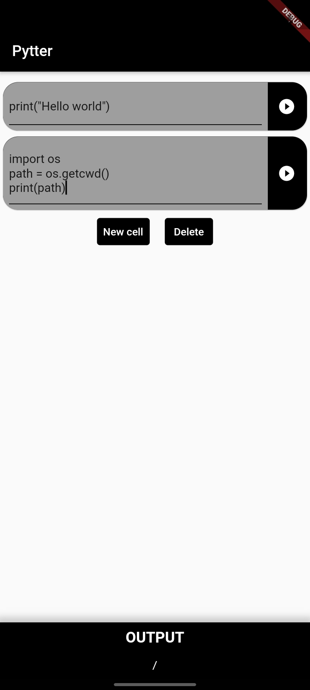
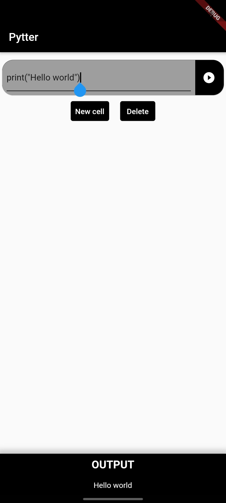

# pytter

Google colab like python interpreter that runs offline with native experience 

||

## Features
- Runs the code form selected cell
- As fast as an PC Interpreter
- Supports numpy

## How to support other packages
Added the package of your choice to the app level [build.grade](https://github.com/dev-Roshan-lab/pytter/blob/main/android/app/build.gradle) file.

## More
- [Chaquopy SDK](https://chaquo.com/chaquopy/)
- [Pub dev package](https://pub.dev/packages/chaquopy)
